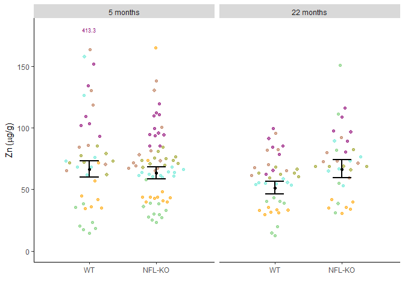
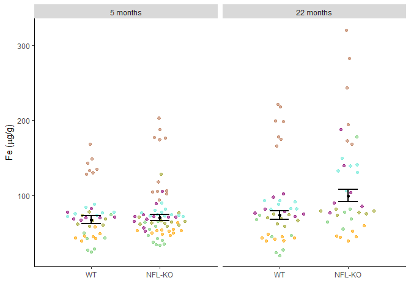
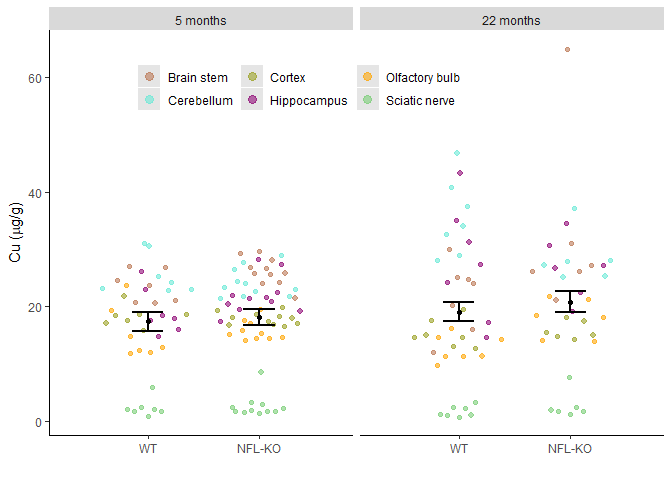
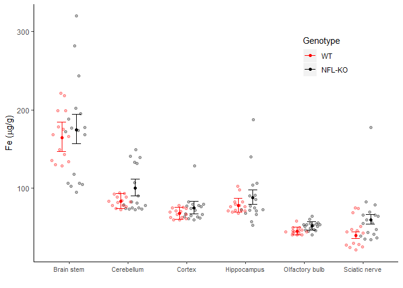
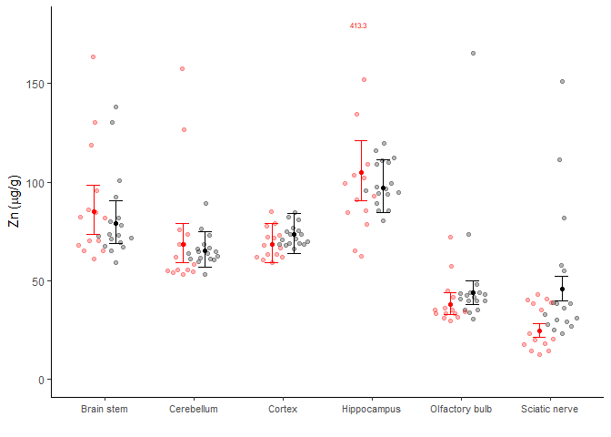
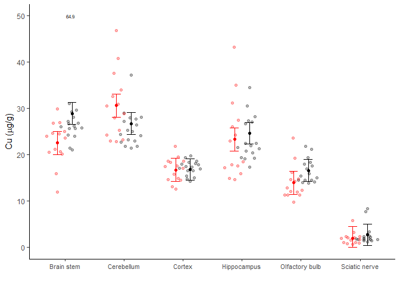

Bindoff, A.
4th July 2019

Reproducible analysis for Vickers et al. (*in press*)

Data are available at
[github.com/ABindoff/nfl-ko\_metals/zn\_fe\_cu\_nfl.csv](https://raw.githubusercontent.com/ABindoff/nfl-ko_metals/master/zn_fe_cu_nfl.csv).
R code at
<https://github.com/ABindoff/nfl-ko_metals/blob/master/analysis_and_figures.Rmd>.

    ## # A tibble: 4 x 3
    ## # Groups:   age [2]
    ##   age   strain     n
    ##   <fct> <fct>  <int>
    ## 1 5     WT         7
    ## 2 5     NFL-KO    11
    ## 3 22    WT         7
    ## 4 22    NFL-KO     6

## Mixed models

``` r
fit.cu <- lmer(Cu ~ region*strain + strain*age + region*age + (1|id), df)
fit.zn <- lmer(logZn ~ region*strain + strain*age + region*age + (1|id), df)
fit.fe <- lmer(logFe ~ region*strain + strain*age + region*age + (1|id), df)
```

Estimate marginal means over regions. Confidence intervals estimated
using Kenward-Roger approximation of degrees of freedom.

Russell Lenth (2019). emmeans: Estimated Marginal Means, aka
Least-Squares Means. R package version 1.3.4.
<https://CRAN.R-project.org/package=emmeans>

## Figures

Some observations were determined not to be outliers but appear
disproportionate in figures. These were identified and plotted as values
instead of points.

<!-- -->

<!-- -->

<!-- -->

<!-- -->

<!-- -->

<!-- -->

## Standardized effect sizes

pseudo- \(f^2_{Cu_{strain}}\) = 0.09  
pseudo- \(f^2_{Fe_{strain}}\) = 0.25  
pseudo- \(f^2_{Zn_{strain}}\) = 0.27

## Reproducibility

    ## R version 3.6.0 (2019-04-26)
    ## Platform: x86_64-w64-mingw32/x64 (64-bit)
    ## Running under: Windows 10 x64 (build 17134)
    ## 
    ## Matrix products: default
    ## 
    ## locale:
    ## [1] LC_COLLATE=English_Australia.1252  LC_CTYPE=English_Australia.1252   
    ## [3] LC_MONETARY=English_Australia.1252 LC_NUMERIC=C                      
    ## [5] LC_TIME=English_Australia.1252    
    ## 
    ## attached base packages:
    ## [1] stats     graphics  grDevices utils     datasets  methods   base     
    ## 
    ## other attached packages:
    ##  [1] MuMIn_1.43.6    lmerTest_3.1-0  latex2exp_0.4.0 lme4_1.1-21    
    ##  [5] Matrix_1.2-17   car_3.0-3       carData_3.0-2   reshape2_1.4.3 
    ##  [9] ggplot2_3.2.0   dplyr_0.8.1     readr_1.3.1    
    ## 
    ## loaded via a namespace (and not attached):
    ##  [1] Rcpp_1.0.1          mvtnorm_1.0-11      lattice_0.20-38    
    ##  [4] assertthat_0.2.1    zeallot_0.1.0       digest_0.6.19      
    ##  [7] utf8_1.1.4          R6_2.4.0            cellranger_1.1.0   
    ## [10] plyr_1.8.4          backports_1.1.4     stats4_3.6.0       
    ## [13] evaluate_0.14       pillar_1.4.1        rlang_0.3.4        
    ## [16] lazyeval_0.2.2      curl_3.3            readxl_1.3.1       
    ## [19] minqa_1.2.4         data.table_1.12.2   nloptr_1.2.1       
    ## [22] rmarkdown_1.13      labeling_0.3        ggeffects_0.10.0   
    ## [25] splines_3.6.0       stringr_1.4.0       foreign_0.8-71     
    ## [28] munsell_0.5.0       vipor_0.4.5         compiler_3.6.0     
    ## [31] numDeriv_2016.8-1.1 xfun_0.8            pkgconfig_2.0.2    
    ## [34] ggbeeswarm_0.6.0    scico_1.1.0         htmltools_0.3.6    
    ## [37] insight_0.3.0       tidyselect_0.2.5    tibble_2.1.3       
    ## [40] rio_0.5.16          fansi_0.4.0         crayon_1.3.4       
    ## [43] withr_2.1.2         MASS_7.3-51.4       sjmisc_2.8.1       
    ## [46] grid_3.6.0          xtable_1.8-4        nlme_3.1-140       
    ## [49] gtable_0.3.0        magrittr_1.5        scales_1.0.0       
    ## [52] zip_2.0.2           estimability_1.3    cli_1.1.0          
    ## [55] stringi_1.4.3       vctrs_0.1.0         boot_1.3-22        
    ## [58] openxlsx_4.1.0.1    sjlabelled_1.1.0    tools_3.6.0        
    ## [61] forcats_0.4.0       beeswarm_0.2.3      glue_1.3.1         
    ## [64] purrr_0.3.2         hms_0.4.2           emmeans_1.3.5      
    ## [67] abind_1.4-5         yaml_2.2.0          colorspace_1.4-1   
    ## [70] knitr_1.23          haven_2.1.0
