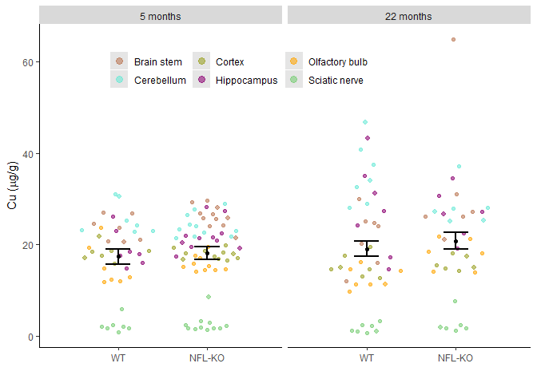
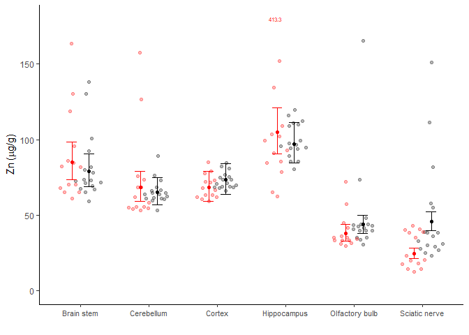
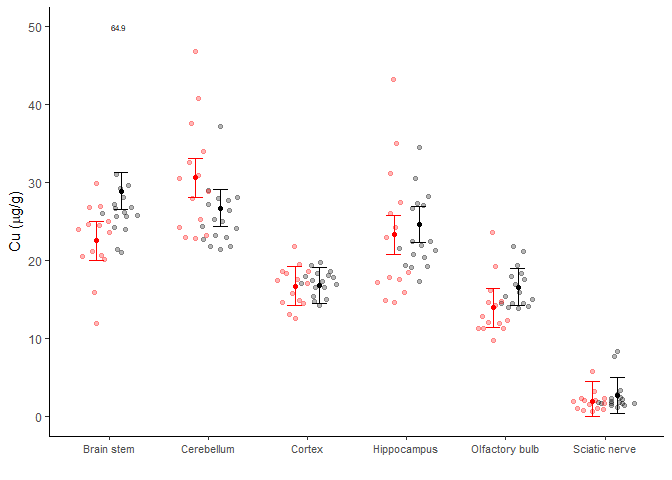

CU, Zn, Fe in brains of NFL knock-out mice
================
Bindoff, A.
7th June 2018

# 

## Data handling

``` r
library(readr)
library(dplyr)
library(ggplot2)
library(reshape2)
library(car)
library(lme4)
library(latex2exp)
library(lmerTest)

df <- read.csv(file = "https://raw.githubusercontent.com/ABindoff/nfl-ko_metals/master/zn_fe_cu_nfl.csv")
lab <- c("WT", "NFL-KO")
```

``` r
df$Cu[df$Cu >= 320] <- NA   # after discussion with PA and GM, assumed to be measurement error
df$logFe <- log(df$Fe)
df$logZn <- log(df$Zn)
df$logCu <- log(df$Cu)
```

    ## # A tibble: 4 x 3
    ## # Groups:   age [2]
    ##   age   strain     n
    ##   <fct> <fct>  <int>
    ## 1 5     WT         7
    ## 2 5     NFL-KO    11
    ## 3 22    WT         7
    ## 4 22    NFL-KO     6

Some observations were determined not to be outliers but appear
disproportionate in figures. These were identified and plotted as values
instead of points in Fig 1 & Fig 2.

``` r
df$zn.label <- ifelse(df$Zn > 180, as.character(round(df$Zn, 1)), NA)
df$cu.label <- ifelse(df$Cu > 50, as.character(round(df$Cu, 1)), NA)
```

## Mixed models

``` r
fit.cu <- lmer(Cu ~ region*strain + strain*age + region*age + (1|id), df)
fit.zn <- lmer(logZn ~ region*strain + strain*age + region*age + (1|id), df)
fit.fe <- lmer(logFe ~ region*strain + strain*age + region*age + (1|id), df)
```

Estimate marginal means over regions. Confidence intervals estimated
using Kenward-Roger approximation of degrees of freedom.

Russell Lenth (2019). emmeans: Estimated Marginal Means, aka
Least-Squares Means. R package version 1.3.4.
<https://CRAN.R-project.org/package=emmeans>

``` r
nd.fe <- ggeffects::ggemmeans(fit.fe, terms = c("strain", "age"), type = "fe", x.as.factor = TRUE) %>%
  transmute(age = group,
            strain = x,
            fit = predicted,
            lwr = conf.low,
            upr = conf.high)

nd.fe.sr <- ggeffects::ggemmeans(fit.fe, terms = c("strain", "region"), type = "fe", x.as.factor = TRUE) %>%
  transmute(region = group,
            strain = x,
            fit = predicted,
            lwr = conf.low,
            upr = conf.high)
```

``` r
nd.cu <- ggeffects::ggemmeans(fit.cu, terms = c("strain", "age"), type = "fe", x.as.factor = TRUE) %>%
  transmute(age = group,
            strain = x,
            fit = predicted,
            lwr = conf.low,
            upr = conf.high)


nd.cu.sr <- ggeffects::ggemmeans(fit.cu, terms = c("strain", "region"), type = "fe", x.as.factor = TRUE) %>%
  transmute(region = group,
            strain = x,
            fit = predicted,
            lwr = conf.low,
            upr = conf.high)
nd.cu.sr$lwr <- ifelse(nd.cu.sr$lwr < 0, 0, nd.cu.sr$lwr)
```

``` r
nd.zn <- ggeffects::ggemmeans(fit.zn, terms = c("strain", "age"), type = "fe", x.as.factor = TRUE) %>%
  transmute(age = group,
            strain = x,
            fit = predicted,
            lwr = conf.low,
            upr = conf.high)


nd.zn.sr <- ggeffects::ggemmeans(fit.zn, terms = c("strain", "region"), type = "fe", x.as.factor = TRUE) %>%
  transmute(region = group,
            strain = x,
            fit = predicted,
            lwr = conf.low,
            upr = conf.high)
```

## Figures

``` r
pa = 0.575
dw = 0.95
set.seed(42)
shuffle <- function(x, set.seed = 42){
  set.seed(set.seed)
  sample(x, length(x), replace = FALSE)
}
pal <- shuffle(scico::scico(n = 6, palette = "hawaii", begin = 0, end = .88, direction = -1),
                                       set.seed = 6)
pal <- pal[c(1,3,5,4,6,2)]
pal[5] <- "#FFA500"
pal[1] <- "#B97551"
df$sizes <- rnorm(nrow(df), 1.5, 0.1)
sz <- c(2,2,2,2,2,2)
```

``` r
foo <- as_labeller(c(`5` = "5 months", `22` = "22 months"))

znplot <- ggplot(nd.zn, aes(x = strain, y = exp(fit), ymin = exp(lwr), ymax = exp(upr))) +
  scale_colour_manual(values = pal,
                        name = element_text("Region")) +
  scale_shape_manual(values = c(19, 15, 19, 19, 15, 19),
                       name = element_text("Region")) +
  scale_size_continuous(guide = FALSE) +
  scale_size_identity() +
  ggbeeswarm::geom_quasirandom(data = df, inherit.aes = FALSE,
                               aes(y = Zn, x = strain,
                                   group = strain, colour = region,
                                   size = sizes),
                               dodge.width = dw,
                               alpha = pa,
                               width = dw/2.2) +
   geom_errorbar(width = 0.28, position = position_dodge(width = dw), size = 1) +
  geom_point(position = position_dodge(width = dw), size = 1.5) +
  theme(panel.grid.major = element_blank(),
        panel.grid.minor = element_blank(),
        panel.background = element_blank(), 
        axis.line = element_line(colour = "black"),
        strip.text = element_text(size = 9),
        legend.position = "none") +
  ylim(0, 180) +
  geom_text(data = df, inherit.aes = FALSE,
            aes(x = strain, y = 180, label = zn.label, colour = region),
            size = 2.5) +
  facet_wrap(~age, labeller = foo) +
  labs(y = TeX("Zn ($\\mu$g/g)"), x = "")

znplot
```

<!-- -->

``` r
feplot <- ggplot(nd.fe, aes(x = strain, y = exp(fit), ymin = exp(lwr), ymax = exp(upr))) +
  scale_colour_manual(values = pal,
                        name = element_text("Region")) +
  # scale_shape_manual(values = c(15, 19, 15, 19, 15, 19),
  #                       name = element_text("Region")) +
    scale_size_continuous(guide = FALSE) +
    scale_size_identity() +
  ggbeeswarm::geom_quasirandom(data = df, inherit.aes = FALSE,
                               aes(y = Fe, x = strain, group = strain, colour = region, size = sizes),#, shape = region),
                               dodge.width = dw,
                               alpha = pa,
                               width = dw/2.2) +
   geom_errorbar(width = 0.28, position = position_dodge(width = dw), size = 1) +
  geom_point(position = position_dodge(width = dw), size = 1.5) +
  theme(panel.grid.major = element_blank(),
        panel.grid.minor = element_blank(),
        panel.background = element_blank(), 
        axis.line = element_line(colour = "black"),
        strip.text = element_text(size = 9),
        legend.position = "none") +
  #ylim(0, 200) +
  facet_wrap(~age, labeller = foo) +
  labs(y = TeX("Fe ($\\mu$g/g)"), x = "")

feplot
```

<!-- -->

``` r
cuplot <- ggplot(nd.cu, aes(x = strain, y = fit, ymin = lwr, ymax = upr)) +
  scale_colour_manual(values = pal,
                        name = NULL) +
   scale_size_manual(values = sz,
                        name = NULL) +
    scale_size_continuous(guide = FALSE) +
    scale_size_identity() +
  ggbeeswarm::geom_quasirandom(data = df, inherit.aes = FALSE,
                               aes(y = Cu, x = strain, group = strain, colour = region, size = sizes),#, shape = region),
                               dodge.width = dw,
                               alpha = pa,
                               width = dw/2.2) +
   geom_errorbar(width = 0.28, position = position_dodge(width = dw), size = 1) +
  geom_point(position = position_dodge(width = dw), size = 1.5) +
  theme(panel.grid.major = element_blank(),
        panel.grid.minor = element_blank(),
        panel.background = element_blank(), 
        axis.line = element_line(colour = "black"),
        strip.text = element_text(size = 9),
        legend.position = c(0.4, .86),
        legend.direction = "horizontal",
        legend.key = element_rect(fill = "grey90")) +
  facet_wrap(~age, labeller = foo) +
  guides(colour = guide_legend(override.aes = list(size=3))) +
  labs(y = TeX("Cu ($\\mu$g/g)"), x = "")

cuplot
```

<!-- -->

``` r
ggsave(file = "fig1.tiff", plot = gridExtra::grid.arrange(feplot, znplot, cuplot, ncol = 1),
       width = 125, height = 240, units = "mm", device = "tiff", dpi = 600)
```

``` r
# nd.fe <- expand.grid(age = '22',
#                      strain = factor(levels(df$strain), levels = c('WT', 'NFL-KO')),
#                      region = factor(levels(df$region)))
# nsim <- 500  
# bootfit <- bootMer(fit.fe, FUN=function(x) predict(x, nd.fe, re.form = NA),
#                    nsim = nsim,
#                    parallel = "multicore",
#                    ncpus = 3L)
# 
# nd.fe$lwr <- apply(bootfit$t, 2, quantile, 0.025)
# nd.fe$upr <- apply(bootfit$t, 2, quantile, 0.975)
# nd.fe$fit <- apply(bootfit$t, 2, mean)
```

``` r
dw = 0.5
p.fe <- ggplot(nd.fe.sr, aes(x = region, y = exp(fit), ymin = exp(lwr), ymax = exp(upr), colour = strain)) +
  ggbeeswarm::geom_quasirandom(data = df, inherit.aes = FALSE,
             aes(x = region, y = Fe, colour = strain, group = strain),
             dodge.width = dw,
                               alpha = pa/2,
                               width = dw/2.2) +
  geom_errorbar(position = position_dodge(width = dw), width = 0.3) +
  geom_point(position = position_dodge(width = dw)) +
  scale_colour_manual(values = c("red", "black"), name = "Genotype") +
  xlab("") +
  ylab(TeX("Fe ($\\mu$g/g)")) +
  theme(panel.grid.major = element_blank(),
        panel.grid.minor = element_blank(),
        panel.background = element_blank(), 
        axis.line = element_line(colour = "black"),
        axis.text.x = element_text(size = 8),
        legend.position = c(0.8, 0.8))

p.fe
```

<!-- -->

``` r
p.zn <- ggplot(nd.zn.sr, aes(x = region, y = exp(fit), ymin = exp(lwr), ymax = exp(upr), colour = strain)) +
 ggbeeswarm::geom_quasirandom(data = df, inherit.aes = FALSE,
             aes(x = region, y = Zn, colour = strain, group = strain),
             dodge.width = dw,
                               alpha = pa/2,
                               width = dw/2.2) +
  geom_errorbar(position = position_dodge(width = dw), width = 0.3) +
  geom_point(position = position_dodge(width = dw)) +
  scale_colour_manual(values = c("red", "black"), name = "Genotype") +
  xlab("") +
  ylab(TeX("Zn ($\\mu$g/g)")) +
  ylim(0, 180) +
  geom_text(data = df, inherit.aes = FALSE,
            aes(x = region, y = 180, label = zn.label, colour = strain),
            size = 2, nudge_x = -.15) +
  theme(panel.grid.major = element_blank(),
        panel.grid.minor = element_blank(),
        panel.background = element_blank(), 
        axis.line = element_line(colour = "black"),
        axis.text.x = element_text(size = 8),
        legend.position = "none")
p.zn
```

<!-- -->

``` r
p.cu <- ggplot(nd.cu.sr, aes(x = region, y = fit, ymin = lwr, ymax = upr, colour = strain)) +
  ggbeeswarm::geom_quasirandom(data = df, inherit.aes = FALSE,
             aes(x = region, y = Cu, colour = strain, group = strain),
             dodge.width = dw,
                               alpha = pa/2,
                               width = dw/2.2) +
  geom_errorbar(position = position_dodge(width = dw), width = 0.3) +
  geom_point(position = position_dodge(width = dw)) +
  scale_colour_manual(values = c("red", "black"), name = "Genotype") +
   ylim(0, 50) +
  geom_text(data = df, inherit.aes = FALSE,
            aes(x = region, y = 50, label = cu.label, colour = strain),
            size = 2, nudge_x = 0.1) +
  xlab("") +
  ylab(TeX("Cu ($\\mu$g/g)")) +
  theme(panel.grid.major = element_blank(),
        panel.grid.minor = element_blank(),
        panel.background = element_blank(), 
        axis.line = element_line(colour = "black"),
        axis.text.x = element_text(size = 8),
        legend.position = "none")
p.cu
```

<!-- -->

``` r
ggsave(file = "fig2.tiff", plot = gridExtra::grid.arrange(p.fe, p.zn, p.cu, ncol = 1),
       width = 125, height = 240, units = "mm", device = "tiff", dpi = 600)
```

## Standardized effect sizes

``` r
# calculate ICC for each model

library(MuMIn)

a <- data.frame(VarCorr(fit.fe))$vcov
icc.fe <- a[1]/(a[1]+a[2])

a <- data.frame(VarCorr(fit.zn))$vcov
icc.zn <- a[1]/(a[1]+a[2])

a <- data.frame(VarCorr(fit.cu))$vcov
icc.cu <- a[1]/(a[1]+a[2])


f2 <- function(AB, A){
  (AB-A)/(1-AB)
}

## Zn

fit.zn.region.strain <- lmer(logZn ~ strain*age + region*age + (1|id), df)
fit.zn.strain.age <- lmer(logZn ~ region*strain + region*age + (1|id), df)
fit.zn.strain <- lmer(logZn ~ region*age + (1|id), df)


rABzn <- r.squaredGLMM(fit.zn)
rA <- r.squaredGLMM(fit.zn.region.strain)
marginal.region.strain.zn <- round(f2(rABzn[1], rA[1]),4)

rA <- r.squaredGLMM(fit.zn.strain.age)
marginal.strain.age.zn <- round(f2(rABzn[1], rA[1]), 4)

rA <- r.squaredGLMM(fit.zn.strain)
marginal.strain.zn <- round(f2(rABzn[1], rA[1]), 2)

## Cu

fit.cu.region.strain <- lmer(Cu ~ strain*age + region*age + (1|id), df)
fit.cu.strain.age <- lmer(Cu ~ region*strain + region*age + (1|id), df)
fit.cu.strain <- lmer(Cu ~ region*age + (1|id), df)

rABcu <- r.squaredGLMM(fit.cu)
rA <- r.squaredGLMM(fit.cu.region.strain)
marginal.region.strain.cu <- round(f2(rABcu[1], rA[1]),4)

rA <- r.squaredGLMM(fit.cu.strain.age)
marginal.strain.age.cu <- round(f2(rABcu[1], rA[1]),4)

rA <- r.squaredGLMM(fit.cu.strain)
marginal.strain.cu <- round(f2(rABcu[1], rA[1]), 2)

## Fe

fit.fe.region.strain <- lmer(logFe ~ strain*age + region*age + (1|id), df)
fit.fe.strain.age <- lmer(logFe ~ region*strain + region*age + (1|id), df)
fit.fe.strain <- lmer(logFe ~ region*age + (1|id), df)

rABfe <- r.squaredGLMM(fit.fe)
rA <- r.squaredGLMM(fit.fe.region.strain)
marginal.region.strain.fe <- round(f2(rABfe[1], rA[1]),4)

rA <- r.squaredGLMM(fit.fe.strain.age)
marginal.strain.age.fe <- round(f2(rABfe[1], rA[1]),4)

rA <- r.squaredGLMM(fit.fe.strain)
marginal.strain.fe <- round(f2(rABfe[1], rA[1]), 2)
```

pseudo- \(f^2_{Cu_{strain}}\) = 0.09  
pseudo- \(f^2_{Fe_{strain}}\) = 0.25  
pseudo- \(f^2_{Zn_{strain}}\) = 0.27

## Reproducibility

``` r
print(sessionInfo())
```
